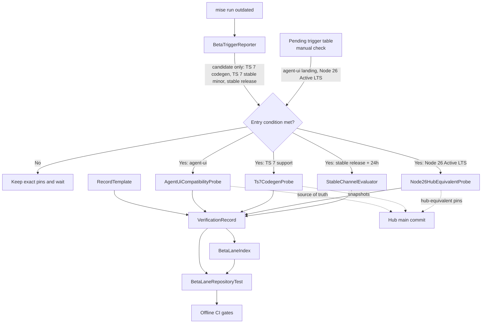
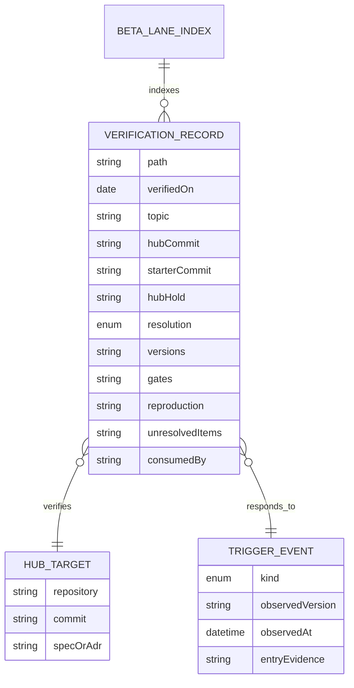

# 001-hub-beta-lane — Technical Plan

Translates approved requirements (WHAT) into architecture (HOW). No implementation code.

見出しの `DES-#.#` は tasks と traceability が参照する安定 ID で、節を足すときは末尾に番号を足し、既存の番号を付け替えない。

## Summary

本計画は、ベータ検証レーンを「記録 contract」「外部トリガー通知」「イベント発火後の隔離 probe」の三層に分ける。即時 scope では既存記録の正規化、索引、オフライン repository test、通知スクリプトの判定部分の切り出しとそのテスト、`openapi-typescript` と TS 7.x stable の通知、README 同期だけを実装し、agent-ui、TS 7-only、Node 26 LTS、安定版切替は entry condition 成立後に plan の file boundaries を改訂して別 task とする。

新規 dependency、製品画面、承認 API、永続化は追加しない。ハブへ渡す成果物は、対象 commit、版、再現手順、gate 結果、三値結論、未解決事項を含む証拠に限定する。

## Architecture Overview (DES-2)



即時変更は document contract と通知経路に限定する。外部状態に依存する probe は CI から分離し、対象ハブ commit を `git archive` 等で scratch workspace に展開して実行する。probe の成功・失敗はいずれも同じ record contract へ保存し、索引から追跡できるようにする。

トリガーの検知経路は二つに分かれる。npm registry で判定できる三つ（`openapi-typescript` の peer/dependency metadata による TS 7 対応候補、TS 7.x stable minor、pinned prerelease に対応する stable）は BetaTriggerReporter が通知する。TS 7.x stable minor は、nightly pin の「stable」列ではなく、監視対象の行（TypeScript の最新 stable）で検知する。registry だけでは判定できない三つ（`openapi-typescript` の公式 release note による TS 7 対応宣言、ハブへの agent-ui source の着地、Node 26 Active LTS）は、`docs/beta-lane/README.md` の「待機中のトリガー」表に確認方法と最終確認日を置き、`mise run outdated` を実行するたびに人が確認する。reporter が引くのは npm registry だけで、release note、Node の release metadata、ハブ repository の自動照会は追加しない。

### Execution Phases (DES-2.1)

| Phase | Entry condition | Scope | Exit evidence |
|---|---|---|---|
| Immediate | requirements/design approval | Requirement 1、3.1、5.1、5.3、および 3.4・5.2 の通知部分 | repository test、reporter test、更新通知、補正済み記録と索引 |
| Agent UI | ハブ `main` に source が着地し commit が確定 | 2.1–2.5 | 無改変 source、fixture unit tests、build/size 記録 |
| TS 7 codegen | 上流 metadata/release note が TS 7 対応候補を示す | 3.2–3.3 | 2 snapshots の byte comparison と TS 6 削除可否 |
| TS 7 stable minor | 直前記録より新しい TS 7.x stable minor が 24h 経過 | 3.4 | Node 24 / Next stable / TS stable の typegen/build 記録 |
| Node 26 | 2026-10-28 以降に Node 26 Active LTS と配布物を確認 | 4.1–4.3 | hub-equivalent gates と変更点一覧 |
| Stable transition | 対応 stable が公開後 24h 経過 | 5.2（README の同期は Immediate の 5.3 の test が引き続き強制する） | prerelease 比較記録、採否、README/pin 同期 |

## Components

### BetaLaneRecordContract (DES-3.1)

- **Responsibility**: 一検証一ファイルの必須構造と、判断に必要な証拠項目を定義する。
- **Public interface**: `docs/beta-lane/TEMPLATE.md`; H2 headings `結論`, `検証した版`, `通したゲート`, `ハブへ持ち込むときの注意` または `ハブへ持ち込むときの手順案`, `再現手順`; H1 直後の固定メタデータ行 `対象ハブコミット`, `検証したコミット`, `対象の据え置き`, `判定`, `未解決事項`（書式は「Record file contract」）。
- **Owns**: ファイル名規則、対象 commit、版、gate、再現手順、`解消` / `部分解消` / `未解消` の語彙。
- **Does NOT own**: 技術的な採否、ハブの release decision、probe 実行、ハブ repository の変更。
- **Requirements**: 1.1, 1.2, 1.3, 1.5, 2.4, 3.2, 3.3, 3.4, 4.1, 4.2, 4.3, 5.2

### BetaLaneIndex (DES-3.2)

- **Responsibility**: 全検証記録を日付、topic、結論、消費先から追跡可能にする。
- **Public interface**: `docs/beta-lane/README.md` の二つの表。記録の索引は `日付`, `トピック`, `結論`, `取り込み先`, `記録` 列。「待機中のトリガー」表は `トリガー`, `対応要件`, `確認方法`, `最終確認日` 列。
- **Owns**: record への相対 link、未取込状態 `未取り込み`、取込後の hub spec/PR reference、registry だけでは判定できないトリガー（`openapi-typescript` の公式 release note、agent-ui の着地、Node 26 Active LTS）の確認手順と最終確認日。
- **Does NOT own**: record 本文、ハブ側 status の自動照会、外部 PR の存在検証。
- **Requirements**: 1.4, 2.1, 3.1, 4.1

### BetaLaneRepositoryTest (DES-3.3)

- **Responsibility**: record contract と index の整合をネットワークなしで検査する。
- **Public interface**: Vitest suite `tests/repo/beta-lane.spec.ts` (`// @vitest-environment node`)。
- **Owns**: `docs/beta-lane/` 配下の Markdown の列挙（`README.md`・`TEMPLATE.md`・日付付き record 以外の Markdown は failure）、必須 heading、固定メタデータ行（commit hash、hold reference、三値判定）、見出しとメタデータの検出から fenced code block の行を除くこと、index の過不足と空欄、「待機中のトリガー」表の必須三行の検査、`package.json` の prerelease（`typescript`・`next`・`@playwright/test`）が範囲指定子なしの exact pin であることの検査（5.1）、README の技術スタック表と WARNING 節に書かれた prerelease の版と exact pin の照合（照合単位は「README version sync contract」）。照合は spec file 内の純粋関数で行い、不一致の fixture でも検査する（実 README がすでに一致していても Red を確認できるようにする）。
- **Does NOT own**: Markdown rendering、外部 URL 到達性、技術結果の正しさ、npm/Node release 状態、「待機中のトリガー」の確認日が新しいかどうか。
- **Requirements**: 1.1, 1.2, 1.3, 1.4, 1.5, 3.1, 5.1, 5.3

### BetaTriggerReporter (DES-3.4)

- **Responsibility**: 既存の更新確認時に、プレリリース pins、TS 7.x stable、TS 7 codegen 候補を人間へ通知する。
- **Public interface**: `mise run outdated`（`mise.toml` は変更しない）。`scripts/check-updates.mjs` は I/O だけを持つ薄い入口とし、判定は `scripts/lib/prerelease-report.ts` の純粋関数に置く。この module は registry の取得関数と現在時刻を引数で受け取り、表の行と exit code を返す。Node 26 は型注釈を外して `.ts` を直接実行できる（tsconfig は `erasableSyntaxOnly: true`）ので、入口は `./lib/prerelease-report.ts` を拡張子付きで import し、テストは拡張子なしで import して `tests/tsconfig.json` の型検査に含める。`scripts/` はどの tsconfig の `include` にもないので、この module の型検査は `tests/repo/check-updates.spec.ts` からの import 経由でだけかかる（`.mjs` の入口は型検査の対象外）。tsconfig は変更しない。
- **Owns**: npm registry read、`minimumReleaseAge` cutoff、候補の表示、registry error の明示（non-zero exit。既存の「エラー行を出して exit 0」からの変更で、README の `mise run outdated` の説明も同じ変更で更新する）、stable 検知時の案内文（5.2 の評価を促す文。caret への切り替えを指示しない）。
- **Tests**: `tests/repo/check-updates.spec.ts`（`// @vitest-environment node`）。fake の取得関数と固定時刻で、24h cutoff、同 channel の最新、stable 列、`openapi-typescript` の peer/dependency 表示、TypeScript stable 行、HTTP error・例外・不正な JSON での error 行と non-zero exit を検査する。ネットワークを使わない。
- **Does NOT own**: package update、lockfile write、CI 判定、TS 7 互換性の断定、probe の自動実行、前回記録した TS stable minor の自動照合（人が索引の記録と見比べる）。
- **Requirements**: 3.1, 3.4, 5.1, 5.2

### AgentUiCompatibilityProbe (DES-3.5)

- **Responsibility**: ハブ正本の agent-ui source をプレリリース toolchain で無改変検証する。
- **Public interface**: source files identified from one hub `main` commit; fixture UI parts for pending approval, approved, denied, tool result, streaming; `mise run typecheck`, `mise run test:run`, `mise run build`, `mise run size`。
- **Owns**: source/import closure の checksum/diff、fixture presentation tests、accessibility assertions、CSS budget、scratch-only bundle entry による JS 計測。
- **Does NOT own**: approval eligibility、API、`fetch`、persistence、audit、real LLM、product route、source の独自修正。
- **Requirements**: 2.1, 2.2, 2.3, 2.4, 2.5

### Ts7CodegenProbe (DES-3.6)

- **Responsibility**: `openapi-typescript` 候補版を TS 7-only 構成で実行し、ハブの生成物と比較する。
- **Public interface**: two hub snapshots as inputs; TS 7-only scratch workspace; byte comparison against committed generated files。
- **Owns**: compiler dependency inventory、generation commands、byte-identical result、TS 6 隔離手順を外せるかの結論。
- **Does NOT own**: hub package update、generated drift の受入れ、peer metadata だけによる対応判定。
- **Requirements**: 3.2, 3.3

### Ts7StableMinorProbe (DES-3.7)

- **Responsibility**: 新しい TS 7.x stable minor をハブ採用候補の安定構成で型検査する。
- **Public interface**: Node 24, hub Next stable, candidate TS 7.x stable; `next typegen`; `next build`。
- **Owns**: 直前に記録した stable minor との差分、typegen/build result。
- **Does NOT own**: nightly 更新、ハブの採用決定、Next canary への切替。
- **Requirements**: 3.4

### Node26HubEquivalentProbe (DES-3.8)

- **Responsibility**: Node 26 Active LTS 移行時のハブ相当構成を隔離環境で検証する。
- **Public interface**: target hub commit; Node 26 LTS; `@types/node` `^26`; hub-pinned Next, TypeScript, Playwright; typecheck, unit, build, E2E gates。
- **Owns**: runtime/type pin substitution、gate result、`mise.toml`、worker Dockerfile、CI runtime propagation の変更点一覧。
- **Does NOT own**: hub の runtime migration decision、hub への commit、starter alpha toolchain の混入。
- **Requirements**: 4.1, 4.2, 4.3

### StableChannelEvaluator (DES-3.9)

- **Responsibility**: pinned prerelease を対応 stable へ切り替えられるかを 24h policy 後に評価する。
- **Public interface**: isolated dependency change; applicable lint, typecheck, unit, build, size, E2E gates; README/version synchronization checklist。
- **Owns**: prerelease/stable comparison、exact pin 継続または stable 版への切替提案、Dependabot ignore の見直し、結果 record。version range 方針の変更はこの evaluator で自動提案せず、別の承認済み依存変更として扱う。
- **Does NOT own**: 公開直後の採用、自動 version write、予算緩和、複数 major の同時変更。
- **Requirements**: 5.1, 5.2, 5.3

## Data Model (DES-4)

永続 database は追加しない。Markdown と script output が contract data である。



| Entity | Field | Type | Notes |
|--------|-------|------|-------|
| VerificationRecord | `path` | `docs/beta-lane/YYYY-MM-DD-<topic>.md` | 一検証一ファイル。`README.md` と `TEMPLATE.md` は対象外 |
| VerificationRecord | `hubCommit` | 7–40 hexadecimal characters \| `不明（遡及補正）` | ハブ `main` の対象 commit。`不明（遡及補正）` は既存記録 `2026-10-03-shadcn-tailwind.md` だけに許す（Record file contract 7） |
| VerificationRecord | `starterCommit` | 7–40 hexadecimal characters | 検証を実行した本リポジトリの commit。例外なし |
| VerificationRecord | `hubHold` | string | §8.1 の行、または具体的な ADR/spec の保留条件 |
| VerificationRecord | `resolution` | `解消` \| `部分解消` \| `未解消` | 成功/失敗の選択的報告を防ぐ。`判定:` 行の値と完全一致で照合する（部分文字列で照合しない） |
| VerificationRecord | `gates` | command/result rows | command と結果を一対で保持 |
| VerificationRecord | `consumedBy` | hub spec/PR reference \| `未取り込み` | 取込後に更新 |
| TriggerEvent | `kind` | `agent-ui` \| `ts7-codegen` \| `ts7-stable-minor` \| `node26-lts` \| `stable-release` | probe lane を一意に選ぶ |
| TriggerEvent | `entryEvidence` | string | registry metadata、release note、hub commit、公式 runtime metadata 等 |

TriggerEvent は独立したファイルに保存しない。発火して probe した場合は、対応する記録の「検証した版」節に `kind`、観測した版、観測日時、entryEvidence を書く。未発火のトリガーは `docs/beta-lane/README.md` の「待機中のトリガー」表に最終確認日だけを残す。

## Interfaces / Contracts

### Record file contract (DES-5.1)

各日付付き record は次を満たす。

1. file name は `YYYY-MM-DD-<topic>.md`。
2. H1 の直後（説明段落より前）に、次の 5 行の固定メタデータを置く。行頭の `- ` とラベル、全角コロンなしの `: ` まで含めて固定とし、repository test は各行を行全体の正規表現で照合する。YAML frontmatter は使わない（parser 依存を増やさない）。

   ```markdown
   - 対象ハブコミット: `<7–40 桁の hex>`
   - 検証したコミット: `<本リポジトリの 7–40 桁の hex>`
   - 対象の据え置き: <§8.1 の行名、または ADR/spec と保留条件>
   - 判定: 解消 | 部分解消 | 未解消
   - 未解決事項: <箇条の要約、または「なし」>
   ```

   照合規則は `` ^- 対象ハブコミット: `[0-9a-f]{7,40}`$ ``、`^- 判定: (解消|部分解消|未解消)$` のように値全体を対象にする。`判定` は三値のいずれか 1 語だけを書き、補足は「結論」節に書く。`includes("解消")` のような部分文字列の照合は使わない（`部分解消`・`未解消` も一致してしまうため）。
3. 必須 H2 headings は「結論」「検証した版」「通したゲート」「ハブへ持ち込むときの注意」または「ハブへ持ち込むときの手順案」「再現手順」。見出し（H1・H2）と固定メタデータの検出では、fenced code block（```` ``` ```` で開閉する範囲）の行を対象にしない。「再現手順」の shell コメント（例: `# 1) …`）を H1 と誤認しないため。
4. 「結論」節は、`判定` の根拠を対象の hold/障害と結び付けて説明する。
5. gate は `mise run <task>` を優先し、command と result を対応付ける。
6. 失敗、測定限界、未解決事項を省略しない。
7. **遡及補正の例外**（spec 1.5 の例外）: `2026-10-03-shadcn-tailwind.md` に限り、`対象ハブコミット` に `不明（遡及補正）` を許す（バッククォートなしで行全体を照合する）。`検証したコミット` には `479bd2a`（移行と記録を含むコミット）を書く。ハブの対象コミットを欠くので、constitution 原則 2 の「対象コミット」に対する例外として扱い、Governance が求める理由・範囲・期限・承認者を「Constitution exceptions」に記録する。この記録はハブの source ではなく、ハブと同じ版の組み合わせ（Node 24 / Next 16.3.8 / TypeScript 6.0.3）で starter を検証したものである。記録のコミット時点（`479bd2a`、2026-10-03 04:31 UTC）のハブ `main` は `apps/web` が `next ^16.3.7`（`04d6d83`）で、`^16.3.8` になったのは記録より後の `834f6f3`（06:43 UTC）だったため、版の組み合わせが一致するハブコミットは存在しない。この事実を「検証した版」節に書き、後から commit を推定して書き込まない。test は例外を file 名の固定 allowlist で持ち、新しい記録には適用しない。

#### Constitution exceptions

| 項目 | 内容 |
|---|---|
| 対象 | constitution 原則 2「対象コミットを記録しなければならない」のうち、ハブの対象コミット |
| 理由 | 記録はハブの source ではなくハブと同じ版の組み合わせで starter を検証したもので、記録時点に版の組み合わせが一致するハブコミットが存在しない（上記 7）。推定で書くと証拠を偽ることになる |
| 範囲 | `docs/beta-lane/2026-10-03-shadcn-tailwind.md` の `対象ハブコミット` 行だけ。repository test の固定 allowlist で、新しい記録には適用しない |
| 期限 | ハブ spec `009` R1〜R4（shadcn/Tailwind への移行）の完了まで。完了時にこの記録を「取り込み先」へ更新し、以後の shadcn/Tailwind 関連の検証はハブコミットを持つ新しい記録で行う。例外の延長・再適用はしない |
| 承認者 | リポジトリ所有者（2026-10-03、本 plan の design 承認とあわせて承認） |

§8.1 に直接対応する行がない agent-ui のような検証は、ハブ ADR/spec の具体的な採用障害を `対象の据え置き` に記載する。`該当なし` だけの記載は contract violation とする。

### Index contract (DES-5.2)

`docs/beta-lane/README.md` は日付付き record を一度ずつ参照する。各 row は日付、トピック、短い結論、hub spec/PR または `未取り込み` を持つ。存在しない file への link、重複 row、未登録 record、空欄のセル（「取り込み先」は `未取り込み` を明記する）は test failure とする。

同じ README に「待機中のトリガー」表を置く。最初の行は次の三つとする。

| トリガー | 対応要件 | 確認方法 | 最終確認日 |
|---|---|---|---|
| `openapi-typescript` の TS 7 対応 release note | 3.1 | 上流の公式 release / changelog に TS 7 対応宣言があるか | 2026-10-03 |
| ハブへの agent-ui source の着地 | 2.1 | ハブ `main` に `apps/web/src/components/agent-ui/` があるか | 2026-10-03 |
| Node 26 Active LTS | 4.1 | `https://nodejs.org/dist/index.json` の 26.x の `lts` 欄 | 2026-10-03 |

registry metadata で判定できる `openapi-typescript` の peer/dependency 候補、TS 7.x stable minor、pinned prerelease の stable は reporter が毎回表示する。release note 経路は registry metadata では検出できないため、この表で別に追跡する。各レーンの entry evidence は記録の「検証した版」節に書く（Data Model）。

`mise run outdated` を実行したら、この表も確認して最終確認日を更新する（README の `mise run outdated` の説明にこの手順を書く）。発火したら行を消し、対応する記録へ移る。test は表と列があることだけを検査し、確認日の新しさは検査しない。

### README version sync contract (DES-5.3)

`README.md` の prerelease 表記と `package.json` の exact pin を、次の単位で照合する。repository test がこれを検査し、pin を上げて README を直し忘れたら失敗させる（5.3）。

| README の箇所 | 現在の書式 | 照合する値 |
|---|---|---|
| 技術スタック表の行（TypeScript / Next.js / Playwright） | `7.1(nightly)`、`16.4(canary)`、`1.64(alpha)` | 行ごとに major.minor と channel |
| WARNING 節の 1 行目 | `TypeScript 7.1 / Next.js 16.4 / Playwright 1.64` | パッケージごとに major.minor だけ |

WARNING 節の channel は「プレリリース版(nightly / canary / alpha)」とまとめて書かれ、パッケージに対応付けられないので照合しない。channel は pin から `dev`→`nightly`、`canary`→`canary`、`alpha`→`alpha` と導く。README の書式はこの表どおりに保ち、書式を変えるときは test と同じ変更で直す。

同じ test で、`package.json` の `typescript`・`next`・`@playwright/test` が `^`・`~`・`>=` などの範囲指定子を持たない exact 版であることも検査する（5.1）。

### Trigger reporter contract (DES-5.4)

`mise run outdated` は次の二つの表を読み取り専用で表示する。

- **Prerelease pins**: package.json に exact pin された prerelease の、24h cutoff を満たす同 channel 更新と対応 stable。stable が出たときの案内文は「Requirement 5.2 の評価を始める（StableChannelEvaluator）」とし、caret への切り替えを指示しない。
- **Watched packages**: 監視対象の最新版。行は次の二つ。
  - `openapi-typescript`: 24h cutoff を満たす latest、publish time、`peerDependencies` / `dependencies` の `typescript` range。
  - `typescript`（stable）: 24h cutoff を満たす最新の stable（prerelease を含まない）。nightly の base に関係なく表示する。人はこの版を索引にある直前の TS stable minor 記録と見比べ、新しい minor なら 3.4 の probe を始める。現在の基準は `2026-10-03-ts7-compiler-api.md` が検証した TS 7.0（7.0.2）で、7.1 以降の stable が 3.4 の対象になる。3.4 の記録を残したら、その minor が次の基準になる。

registry error（HTTP の非 2xx、`fetch` の例外、不正な JSON）は成功扱いで黙殺せず、対象 package と status を行に出し、全行を表示したあと command を non-zero にする。既存の script はエラー行を出して exit 0 で終わるので、これは意図した動作の変更であり、オフライン時は `mise run outdated` が失敗する。README の説明を同じ変更で更新する。候補表示は compatibility の結論ではない。

判定はすべて `scripts/lib/prerelease-report.ts` の純粋関数で行い、`tests/repo/check-updates.spec.ts` が fake の取得関数と固定時刻で検査する（constitution 原則 4: 挙動変更の前に失敗するテストを置く）。

### Probe entry contracts (DES-5.5)

| Lane | Entry condition | Required isolation | Required comparison |
|------|-----------------|--------------------|---------------------|
| Agent UI | ハブ `main` に source landing、対象 commit と import closure が確定 | repo copy + temporary scratch bundle entry | source diff/checksum、fixture behavior、CSS/JS budgets |
| TS 7 codegen | metadata または release note が TS 7 対応候補を示す | TS 7-only scratch workspace | 2 generated files の byte identity |
| TS 7 stable minor | 前回記録より新しい TS 7.x stable minor が 24h 経過 | hub-equivalent stable scratch | `next typegen`, `next build` |
| Node 26 | 公式 metadata が Node 26 Active LTS を示す | target hub commit の archive | Node 以外の pins を維持した gates |
| Stable transition | 対応 stable が公開後 24h 経過 | one dependency lane per isolated change | prerelease baseline と stable result |

Agent UI の temporary bundle entry は scratch workspace にだけ置き、全 copied component を import/render して client chunk を生成する。追跡対象 repository へ showcase route や approval flow を追加しない。実 source が中立 props でない場合は shim を自動導入せず、ハブへ報告して plan を改訂する。

### Gate matrix (DES-5.6)

| Change / probe | Required gates |
|----------------|----------------|
| Documentation + repository test + reporter | `mise run lint`, `mise run typecheck`, `mise run test:run`（`tests/repo/beta-lane.spec.ts` と `tests/repo/check-updates.spec.ts` を含む）, `mise run build` |
| Agent UI | 上記 + `mise run test:e2e`, `mise run size`; scratch bundle でも build/size |
| TS 7 codegen | generation/diff probe + `mise run lint`, `mise run typecheck`, `mise run test:run`, `mise run build` |
| Node 26 hub-equivalent | hub の typecheck, Vitest, build, Playwright。starter の alpha pins は混ぜない |
| Stable transition | standard gates + affected UI/client assets の E2E/size |

spec 2.3 が挙げる `typecheck`・`vitest`・`build`・`size` は Agent UI レーンの最低限で、constitution 原則 5 が常に求める `lint` と、client asset を変えるときに求める `test:e2e` を加えたこの表の行が実際に通すゲートである。template（`docs/beta-lane/TEMPLATE.md`）はゲートを独自に列挙せず、この表を参照する。

## File Structure Plan (DES-6)

以下は **Immediate phase の task boundary** である。tasks はこの表にない file を変更しない。

| File | Create/Modify | Responsibility |
|------|---------------|----------------|
| `docs/beta-lane/TEMPLATE.md` | Create | 固定メタデータ 5 行と必須 H2 headings を定義する record contract。 |
| `docs/beta-lane/README.md` | Create | 全 verification record の索引と、release note・agent-ui・Node 26 を追跡する「待機中のトリガー」表。 |
| `docs/beta-lane/2026-10-03-shadcn-tailwind.md` | Modify | 固定メタデータ（`対象ハブコミット: 不明（遡及補正）`、`検証したコミット: 479bd2a`、対象の据え置き = ADR-0008）、「検証した版」（遡及補正の根拠を含む）、「再現手順」を追記して contract に適合させる。 |
| `docs/beta-lane/2026-10-03-ts7-compiler-api.md` | Modify | 既存の `対象:` 行を固定メタデータ 5 行（ハブ `1a08a97`、本リポジトリ `cb5f86e`、§8.1 `typescript` 6.x、`部分解消`）に置き換え、`## 結果` を `## 通したゲート` に改名して command/result の対応を補う。ハブはこの記録をファイル単位でしか参照していないので（ハブ `specs/009` で確認）、互換用の見出しは残さない。 |
| `tests/repo/beta-lane.spec.ts` | Create | beta-lane 配下の未認識 Markdown、日付付き records の固定メタデータと見出し、index の双方向整合と空欄、トリガー表の存在、prerelease の exact pin、README の版表記と exact pin の一致をオフライン Vitest で検査する。 |
| `scripts/lib/prerelease-report.ts` | Create | 取得関数と時刻を注入できる純粋関数。pin 行、監視行（`openapi-typescript`、TypeScript stable）、error 行、exit code、案内文を決める。 |
| `tests/repo/check-updates.spec.ts` | Create | `prerelease-report.ts` を fake の取得関数と固定時刻で検査する node 環境の Vitest。 |
| `scripts/check-updates.mjs` | Modify | `package.json` / `pnpm-workspace.yaml` の読み込み、`fetch`、表示、`process.exitCode` だけを持つ入口にし、判定を `prerelease-report.ts` に委ねる。 |
| `README.md` | Modify | beta-lane index への導線、exact prerelease pins / WARNING の同期、`mise run outdated` の説明（registry error で失敗すること、トリガー表の確認手順、TS stable minor の比較基準）、「プレリリース版の更新」節を 5.2 の評価手順（StableChannelEvaluator、記録、`mise run` のゲート）へ書き換える。 |

`mise.toml`、`package.json`、lockfile、CI workflow、`src/lib/ai/**`、`src/app/api/**` は Immediate phase では変更しない。`mise run gate` の追加は constitution Sync Impact Report どおり別 tooling change とする。

### Event-gated plan amendments (DES-6.1)

次の file は現時点の task boundary ではない。entry condition 成立後、対象 commit、実 file/import closure、記録日を確定してこの section を具体的 path で改訂し、design approval を取り直してから task 化する。

- Agent UI: ハブから着地した `src/components/agent-ui/` の実 files、必要な既存/追加 shadcn primitives、fixture helper、component tests、日付付き verification record。
- TS 7 codegen: 日付付き verification record。probe は tracked product code を増やさず scratch で実行する。
- TS 7 stable minor: 日付付き verification record。採用する場合のみ version pins と README の具体的 files を追加する。
- Node 26: 日付付き verification record。starter 本体の Node pins は hub probe のためには変更しない。
- Stable transition: candidate ごとの package/version files、lockfile、README、Dependabot ignore、日付付き record を一つの lane として列挙する。

## Error Handling & Edge Cases (DES-7)

- record filename が日付規則に合わない → index 対象にせず成功させるのではなく、beta-lane 配下の未認識 Markdown として test failure にする（1.1）。
- fenced code block 内に `#` で始まる行がある（例: ts7 記録の「再現手順」）→ 見出しとして数えない。数えると H1 の重複やメタデータ位置の誤判定になるので、fixture で検査する（1.2）。
- 必須 heading が別名または欠落 → exact contract を示して test failure。外部から anchor 参照されている heading を改名する場合だけ、互換用の heading を残す（1.2）。
- 固定メタデータ行が欠落・順序違い・値が範囲外（例: `判定: 概ね解消`）→ 行全体の照合で test failure（1.3, 1.5）。
- hold reference が `該当なし` のみ → concrete §8.1 row または ADR/spec obstacle を要求する（1.3）。
- index が未取込 record を持つ → `未取り込み` を有効値とし、空欄は failure（1.4）。
- target commit が branch 名だけ → immutable commit hash を要求する（1.5）。
- 新しい記録が `不明（遡及補正）` を使う → allowlist にない file 名なので test failure（1.5）。
- README の版表記と exact pin が不一致 → test failure（5.3）。
- prerelease の pin が範囲指定に変わった → test failure（5.1）。
- agent-ui source に local modification が必要 → tracked source は変更せず probe を止め、差分と原因を record に保存してハブへ返す（2.4, 2.5）。
- agent-ui import closure が product-only schema/API を要求 → shim や schema コピーを即断せず、ハブの中立 props contract 違反として plan amendment を要求する（2.1, 2.5）。
- unit tests は通るが scratch build/size が失敗 → Requirement 2.3 は未解消。予算を緩和せず原因と結果を保存する（2.3）。
- scratch bundle entry で approval action が必要 → callback spy と fixture のみを使い、API、storage、real model は導入しない（2.2）。
- npm registry が unavailable / malformed（HTTP error、`fetch` の例外、不正な JSON）→ reporter は残りの package も処理したうえで package 名と error を表示して non-zero で終わり、古い情報を latest として扱わない（3.1, 5.1）。
- nightly の pin を先に上げて、その base より前の TS stable minor が出た → pin 行の stable 列には出ないが、監視行の TypeScript stable に出るので見落とさない（3.4）。
- `openapi-typescript` peer が `^7` を含まないが upstream が compatibility を宣言 → candidate として手動 probe し、peer と挙動を別項目で記録する（3.1, 3.2）。
- generated files に差分がある → byte-identical 条件は未解消。生成 drift を incidental update として受け入れない（3.2）。
- TS 7-only probe が通る → record はハブが削除可能な `packages/schemas` の TS 6 step を明示する（3.3）。
- 新 stable minor が前回と同一 → duplicate probe を作らず、最後に記録した minor を基準にする（3.4）。
- 2026-10-28 を過ぎたが公式 metadata が Active LTS でない → date だけで発火させず待機する（4.1）。
- Node 26 probe が starter alpha を必要とする → hub-equivalent 条件を満たさないため別結果として扱い、ハブ採用根拠にしない（4.1）。
- hub CI に Node version の直書きがない → `mise.toml` が CI jobs へ伝播する事実を変更点一覧へ記載する（4.2）。
- stable が公開済みだが 24h 未満 → exact prerelease pin を維持し評価を開始しない（5.1, 5.2）。
- stable で behavior difference がない → 差分なしも record に保存し、採用/据え置き理由を明記する（5.2）。
- README と pins が不一致 → stable/prerelease change を完了扱いにしない（5.3）。

## Constitution Compliance (DES-8)

| Principle / MUST group | Status | Notes |
|------------------------|--------|-------|
| 1. 軽量スターターとしての責務分離 | ✅ | 新規 dependency、認証、RBAC、approval workflow、RAG、Python lane を追加しない。agent-ui はハブ正本の表示専用 source に限定する。 |
| 2. 証拠に基づく先行検証 | ✅ | version、hub commit、reproduction、gates、result、unresolved items、三値結論を record contract と offline test で必須化する。失敗も保存する。既存記録の遡及補正では hub commit を推定で書かず、`不明（遡及補正）` と根拠を書く（spec 1.5 の例外、1 記録だけの allowlist）。全記録に本リポジトリの `検証したコミット` を必須にする。ハブコミットを欠く 1 件は DES-5.1「Constitution exceptions」で例外として扱う。 |
| 3. 型安全なサーバーファースト設計 | ✅ | source landing 時は strict typing と中立 props を entry check にする。`any`、根拠のない assertion、Zod/client crossing を許可しない。API/model files は非変更。 |
| 4. 決定論的で隔離された検証 | ✅ | repository test は offline。通知スクリプトの挙動変更（`openapi-typescript`・TS stable の行、registry error の non-zero exit、案内文）は `tests/repo/check-updates.spec.ts` を先に Red にしてから実装し、fake の取得関数と固定時刻を注入する。UI は fixture と callback spy のみで実 LLM/API を使わない。外部 release probe は scratch に隔離する。 |
| 5. 一つの品質経路と定量的予算 | ✅ | 現行の `lint`、`typecheck`、`test:run`、`build` を最低経路とし、UI/client change は E2E/size を追加する。240 kB JS / 6 kB CSS を緩和しない。 |
| 6. 再現可能で安全な依存管理 | ✅ | `mise run outdated` を実行済み。exact prerelease と 24h cutoff を維持し、stable transition を一 dependency lane ずつ隔離する。新規 dependency/allowBuilds 変更なし。 |
| Language / artifact location | ✅ | plan、research、records は日本語。code identifiers/path は英語。成果物は既存 `specs/001-hub-beta-lane/` と `docs/beta-lane/` に置く。 |
| Next.js current-version guidance | ✅ | agent-ui/build harness を実装する event phase では、実装前に installed `node_modules/next/dist/docs/` の TypeScript/testing/build guidance を確認する。Immediate phase は Next.js code を変更しない。 |
| UI standard and client boundary | ✅ | ハブ source と既存 shadcn/Tailwind を再利用し、product route を追加しない。native select/API/chat guard/model allowlist は非変更。 |
| SDD ordering and approval | ✅ | 2026-10-03 の `/sdd-analyze` 指摘と、その後の承認状態・release note 経路・traceability 表現・stable 切替方針の整合修正を反映した spec・plan・tasks を、リポジトリ所有者が同日に承認した（`spec.json` の approvals は requirements・design・tasks とも `approved: true`）。以後 spec または plan を改訂した場合は承認を取り消し、再承認を経てから実装を続ける。本 plan は全 numeric requirements と MUST rules を trace する。event phase は plan amendment と design re-approval 後に task 化する。 |
| Governance / exceptions | ✅ | 原則 2 の例外が 1 件（shadcn 記録のハブコミット）。理由・範囲・期限・承認者は DES-5.1「Constitution exceptions」に記録し、2026-10-03 に design 承認とあわせて承認された。`mise run gate` は既存の明示的代替経路を使い、別 tooling change へ留保する。 |

## Requirements Traceability

| Requirement ID | Component(s) |
|----------------|--------------|
| 1.1 | BetaLaneRecordContract, BetaLaneRepositoryTest |
| 1.2 | BetaLaneRecordContract, BetaLaneRepositoryTest |
| 1.3 | BetaLaneRecordContract, BetaLaneRepositoryTest |
| 1.4 | BetaLaneIndex, BetaLaneRepositoryTest |
| 1.5 | BetaLaneRecordContract, BetaLaneRepositoryTest |
| 2.1 | BetaLaneIndex（待機中のトリガー）, AgentUiCompatibilityProbe |
| 2.2 | AgentUiCompatibilityProbe |
| 2.3 | AgentUiCompatibilityProbe |
| 2.4 | AgentUiCompatibilityProbe, BetaLaneRecordContract |
| 2.5 | AgentUiCompatibilityProbe |
| 3.1 | BetaTriggerReporter, BetaLaneIndex, BetaLaneRepositoryTest |
| 3.2 | Ts7CodegenProbe, BetaLaneRecordContract |
| 3.3 | Ts7CodegenProbe, BetaLaneRecordContract |
| 3.4 | BetaTriggerReporter, Ts7StableMinorProbe, BetaLaneRecordContract |
| 4.1 | BetaLaneIndex（待機中のトリガー）, Node26HubEquivalentProbe, BetaLaneRecordContract |
| 4.2 | Node26HubEquivalentProbe, BetaLaneRecordContract |
| 4.3 | Node26HubEquivalentProbe, BetaLaneRecordContract |
| 5.1 | BetaTriggerReporter, BetaLaneRepositoryTest, StableChannelEvaluator |
| 5.2 | BetaTriggerReporter, StableChannelEvaluator, BetaLaneRecordContract |
| 5.3 | StableChannelEvaluator, BetaLaneRepositoryTest |
